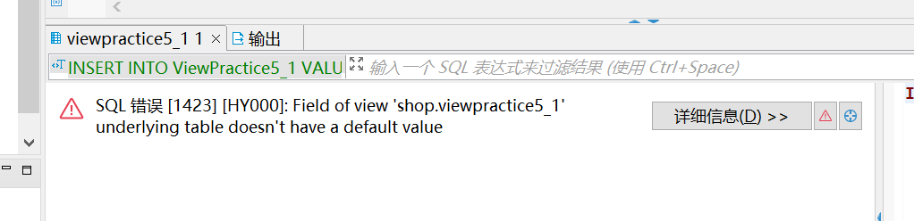
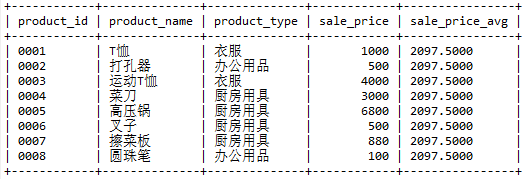
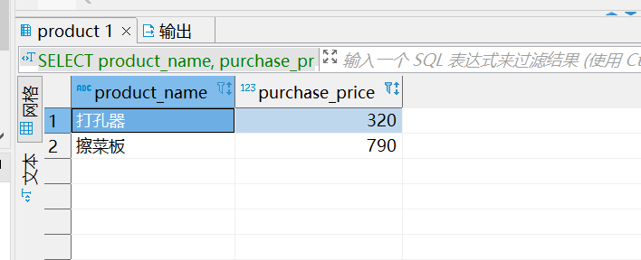

#task03
## 3.1

创建出满足下述三个条件的视图（视图名称为 ViewPractice5_1）。使用 product（商品）表作为参照表，假设表中包含初始状态的 8 行数据。

* 条件 1：销售单价大于等于 1000 日元。
* 条件 2：登记日期是 2009 年 9 月 20 日。
* 条件 3：包含商品名称、销售单价和登记日期三列。

对该视图执行 SELECT 语句的结果如下所示。

```sql
SELECT * FROM ViewPractice5_1;
```
执行结果

```sql
product_name | sale_price | regist_date
--------------+------------+------------
T恤衫         | 　 1000    | 2009-09-20
菜刀          |    3000    | 2009-09-20
```

###answer
```sql
CREATE VIEW ViewPractice5_1(product_name,sale_price,regist_date)
AS
SELECT product_name,sale_price,regist_date
FROM product
WHERE sale_price>=1000 AND regist_date ='2009-9-20';
```

## 3.2

向习题一中创建的视图 `ViewPractice5_1` 中插入如下数据，会得到什么样的结果？为什么？

```sql
INSERT INTO ViewPractice5_1 VALUES (' 刀子 ', 300, '2009-11-02');
```

###answer


## 3.3

请根据如下结果编写 SELECT 语句，其中 sale_price_avg 列为全部商品的平均销售单价。



####answer
```sql
SELECT product_id ,product_name ,product_type, sale_price,
(SELECT avg(sale_price)
	FROM product) AS sale_price_avg
	FROM product;
```


## 3.4

请根据习题一中的条件编写一条 SQL 语句，创建一幅包含如下数据的视图（名称为AvgPriceByType）。


提示：其中的关键是 `sale_price_avg_type` 列。与习题三不同，这里需要计算出的 是各商品种类的平均销售单价。这与使用关联子查询所得到的结果相同。 也就是说，该列可以使用关联子查询进行创建。问题就是应该在什么地方使用这个关联子查询。
###answer
```sql
-- 3.4(没做出来)
CREATE VIEW AvgPriceByType
AS 
SELECT product_id,product_name,p1.product_type,sale_price,p2.avg_sale_price_type
FROM product AS p1,
(SELECT product_type,avg(sale_price) AS avg_sale_price_type
FROM product 
GROUP BY product_type
) AS p2
WHERE p1.product_type =p2.product_type ;

SELECT * FROM avgpricebytype;
```
这题思来想去没做出来，本来想用标量子查询，但是子查询中没有p1，后来参考网上的做法将p2搬到表格来写，希望能在答案中看到更新颖的做法。
## 3.5 判断题

四则运算中含有 NULL 时（不进行特殊处理的情况下），运算结果是否必然会变为NULL ？
###answer
我认为是的，因为四则运算指的是加减乘除。

## 3.6

对本章中使用的 `product`（商品）表执行如下 2 条 `SELECT` 语句，能够得到什么样的结果呢？

①

```sql
SELECT product_name, purchase_price
  FROM product
 WHERE purchase_price NOT IN (500, 2800, 5000);
```
②
```sql
SELECT product_name, purchase_price
  FROM product
 WHERE purchase_price NOT IN (500, 2800, 5000, NULL);
```
###answer



## 3.7

按照销售单价( `sale_price` )对练习 3.6 中的 `product`（商品）表中的商品进行如下分类。

* 低档商品：销售单价在1000日元以下（T恤衫、办公用品、叉子、擦菜板、 圆珠笔）
* 中档商品：销售单价在1001日元以上3000日元以下（菜刀）
* 高档商品：销售单价在3001日元以上（运动T恤、高压锅）

请编写出统计上述商品种类中所包含的商品数量的 SELECT 语句，结果如下所示。

执行结果

```sql
low_price | mid_price | high_price
----------+-----------+------------
        5 |         1 |         2
```

###answer
```sql
SELECT sum(CASE WHEN sale_price<=1000 THEN 1 ELSE 0 END) AS low_price,
	   sum(CASE WHEN sale_price BETWEEN 1001 AND 3000 THEN 1 ELSE 0 END)AS mid_price,
	   sum(CASE WHEN sale_price>=3001 THEN 1 ELSE 0 END) AS high_price
  FROM product;
```

#some notes
##视图
对于一个视图来说，如果包含以下结构的任意一种都是不可以被更新的：

* 聚合函数 SUM()、MIN()、MAX()、COUNT() 等。
* DISTINCT 关键字。
* GROUP BY 子句。
* HAVING 子句。
* UNION 或 UNION ALL 运算符。
* FROM 子句中包含多个表。

视图归根结底还是从表派生出来的，因此，如果原表可以更新，那么 视图中的数据也可以更新。反之亦然，如果视图发生了改变，而原表没有进行相应更新的话，就无法保证数据的一致性了。
## 3.2.1 什么是子查询

子查询指一个查询语句嵌套在另一个查询语句内部的查询，这个特性从 MySQL 4.1 开始引入，在 SELECT 子句中先计算子查询，子查询结果作为外层另一个查询的过滤条件，查询可以基于一个表或者多个表。

## 3.2.2 子查询和视图的关系

子查询就是将用来定义视图的 SELECT 语句直接用于 FROM 子句当中。其中AS studentSum可以看作是子查询的名称，而且由于子查询是==一次性==的，所以子查询不会像视图那样保存在存储介质中， 而是在 SELECT 语句执行之后就消失了。

## 3.2.6 关联子查询
但是如果刚接触的话一定会比较疑惑关联查询的执行过程，这里有一个[博客](https://zhuanlan.zhihu.com/p/41844742)讲的比较清楚。在这里我们简要的概括为：

1. 首先执行不带WHERE的主查询
2. 根据主查询讯结果匹配product_type，获取子查询结果
3. 将子查询结果再与主查询结合执行完整的SQL语句

*在子查询中像标量子查询，嵌套子查询或者关联子查询可以看作是子查询的一种操作方式即可。*

## 3.3 各种各样的函数


函数大致分为如下几类：

* 算术函数    （用来进行数值计算的函数）
* 字符串函数 （用来进行字符串操作的函数）
* 日期函数     （用来进行日期操作的函数）
* 转换函数     （用来转换数据类型和值的函数）
* 聚合函数     （用来进行数据聚合的函数）

## 3.4.6 使用子查询作为IN谓词的参数

* IN和子查询

IN 谓词（NOT IN 谓词）具有其他谓词所没有的用法，那就是可以使用子查询作为其参数。我们已经在 5-2 节中学习过了，==__子查询就是 SQL内部生成的表__==，因此也可以说“能够将表作为 IN 的参数”。同理，我们还可以说“能够将视图作为 IN 的参数”。