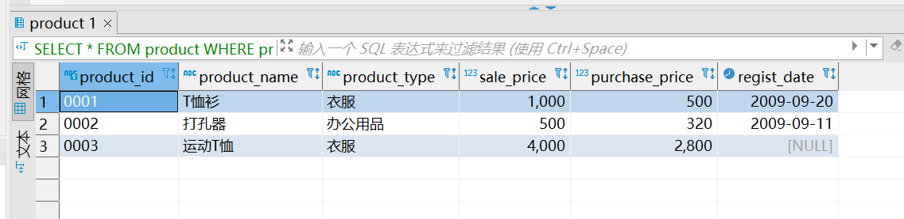
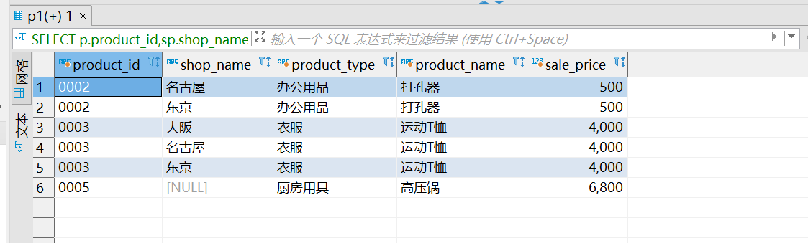
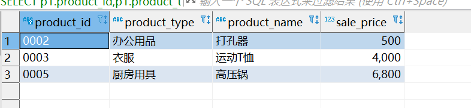

#task04

# **4.1** 

找出 product 和 product2 中售价高于 500 的商品的基本信息。
##answer
```sql
-- 4.1
 SELECT * FROM product
 WHERE sale_price>500
 UNION
 SELECT * FROM product2 
 WHERE sale_price>500;
 ```
 

# **4.2**

借助对称差的实现方式, 求product和product2的交集。
```sql
/*4.2(没做出来,后来突然想起来两个表的交集肯定包含于其中一个表，那么就可以用一个表去掉对称差集就好啦，希望能看到官方答案，不知道有没有
用两个表的并集直接去减掉对称差集)
*/
SELECT *
  FROM product
 WHERE product_id NOT IN 
(SELECT product_id 
  FROM Product
 WHERE product_id NOT IN (SELECT product_id FROM Product2)
UNION
SELECT product_id 
  FROM Product2
 WHERE product_id NOT IN (SELECT product_id FROM Product));
 ```
 

# **4.3**

每类商品中售价最高的商品都在哪些商店有售 ？
```sql
/*4.3(好难，花了很长时间，刚开始group by有参考别人的答案
 思路主要是拆解题目，从里到外
 首先要提取出每个类别的最大价格，再找到对应的名称；我试过group by了以后)
 首先要提取除每个类别对应的最大价格，再最大价格对应的名字
 我试过直接group by找出每个类别最大价格对应的商品名字，并不能找到，因为group by的对象是product_type，所以在group by后通过条件找到名字
 所以要找到商品名字要通过内联的操作
 找到名字后要与shopproduct的product_id进行关联（注意每个商品名称都要有，所以这时候关联要用outer inner)
 但是我的方法缺点是不太整洁
 可以分别将product与shopproduct根据product_id进行外联以及最高商品与名字内联，再将得到的两个表内联（其实也就是结合律问题，本质无区别）
 */
SELECT p.product_id,sp.shop_name,p.product_type,p.product_name,p.sale_price 
FROM (SELECT product_id ,shop_name
FROM shopproduct) sp
RIGHT JOIN
(SELECT p1.product_id,p1.product_type,p1.product_name,p1.sale_price 
FROM product p1
INNER JOIN
(SELECT product_id,product_type,max(sale_price) AS msp
  FROM product 
 GROUP BY product_type) p2
 ON p1.sale_price=p2.msp
AND p1.product_type=p2.product_type) p
ON sp.product_id=p.product_id;
```



# **4.4**

分别使用内连结和关联子查询每一类商品中售价最高的商品。
```sql
-- 4.4
-- 内连接
SELECT p1.product_id,p1.product_type,p1.product_name,p1.sale_price 
FROM product p1
INNER JOIN
(SELECT product_id,product_type,max(sale_price) AS msp
  FROM product 
 GROUP BY product_type) p2
 ON p1.sale_price=p2.msp
AND p1.product_type=p2.product_type;

-- 关联子查询
SELECT p1.product_id,p1.product_type,p1.product_name,p1.sale_price 
FROM product p1
WHERE p1.sale_price=(SELECT max(sale_price)
FROM product p2
WHERE p1.product_type =p2.product_type 
GROUP BY product_type);
```


# **4.5** 

用关联子查询实现：在 product 表中，取出 product_id, product_name, sale_price, 并按照商品的售价从低到高进行排序、对售价进行累计求和。

```sql
-- 4.5
SELECT product_id,product_name ,sale_price,sum(p2_price) AS cum_price
FROM 
(SELECT p1.product_id, p1.product_name,p1.sale_price,
       p2.product_id AS p2_id, p2.product_name AS p2_name, p2.sale_price AS p2_price
  FROM product p1
LEFT OUTER JOIN product p2
    ON p1.sale_price>p2.sale_price 
    OR (p1.sale_price=p2.sale_price
   AND p1.product_id<=p2.product_id)
ORDER BY p1.sale_price,p1.product_id) p
GROUP BY product_id, product_name,sale_price #这里group by多个关键字可能是因为在实践中不一定一个id对应一个名字，所以group by多个关键字会更加安全
ORDER BY cum_price;
```
