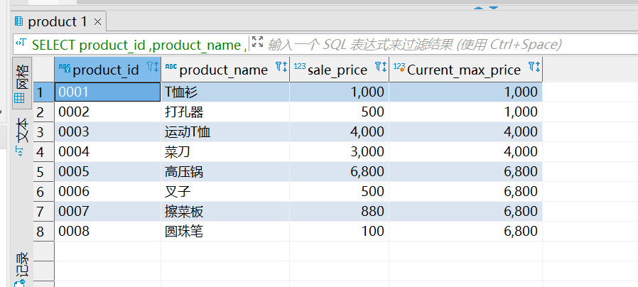
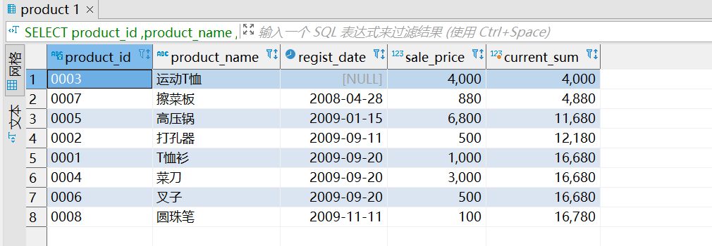

#task5

## **5.1**

请说出针对本章中使用的 product（商品）表执行如下 SELECT 语句所能得到的结果。


```sql
SELECT  product_id
       ,product_name
       ,sale_price
       ,MAX(sale_price) OVER (ORDER BY product_id) AS Current_max_price
  FROM product;
```

答：按照sale_price顺序的累计值


## **5.2**

继续使用product表，计算出按照登记日期（regist_date）升序进行排列的各日期的销售单价（sale_price）的总额。排序是需要将登记日期为NULL 的“运动 T 恤”记录排在第 1 位（也就是将其看作比其他日期都早）
```sql
-- 5.2 
 SELECT product_id
       ,product_name
       ,regist_date
       ,sale_price
       ,sum(sale_price) OVER (ORDER BY regist_date) AS current_sum
   FROM product;
   ```



## **5.3**

思考题

① 窗口函数不指定PARTITION BY的效果是什么？


答：不指定时，对排序列进行全列排序，见上例

② 为什么说窗口函数只能在SELECT子句中使用？实际上，在ORDER BY 子句使用系统并不会报错.

答：是因为SQL语句的执行顺序，（FROM->WHERE->GROUP BY -> HAVING->SELECT->ORDER BY),如果在WHERE、GROUP BY、HAVING子句中使用窗口函数，则会先进行一次排序，在执行WHERE、GROUP BY、HAVING各自的功能，会发出错误或失去窗口函数的使用意义

## **5.4**

使用存储过程创建20个与 `shop.product` 表结构相同的表，如下图所示：


## SOME NOTES

## 5.2.1 专用窗口函数

* **RANK函数**

计算排序时，如果存在相同位次的记录，则会跳过之后的位次。

例）有 3 条记录排在第 1 位时：1 位、1 位、1 位、4 位……

* **DENSE_RANK函数**

同样是计算排序，即使存在相同位次的记录，也不会跳过之后的位次。

例）有 3 条记录排在第 1 位时：1 位、1 位、1 位、2 位……

* **ROW_NUMBER函数**

赋予唯一的连续位次。


最后存储过程还有非常多没有理解的部分，需要多查相应的资料。
