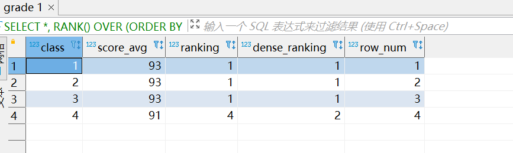

#task6

*因为这两天有点事情，今天才赶完taskA，过几天会都补上的*

## Section A

### 练习一: 各部门工资最高的员工（难度：中等）

创建Employee 表，包含所有员工信息，每个员工有其对应的 Id, salary 和 department Id。

```plain
+----+-------+--------+--------------+
| Id | Name  | Salary | DepartmentId |
+----+-------+--------+--------------+
| 1  | Joe   | 70000  | 1            |
| 2  | Henry | 80000  | 2            |
| 3  | Sam   | 60000  | 2            |
| 4  | Max   | 90000  | 1            |
+----+-------+--------+--------------+
```


创建Department 表，包含公司所有部门的信息。
```plain
+----+----------+
| Id | Name     |
+----+----------+
| 1  | IT       |
| 2  | Sales    |
+----+----------+
```
编写一个 SQL 查询，找出每个部门工资最高的员工。例如，根据上述给定的表格，Max 在 IT 部门有最高工资，Henry 在 Sales 部门有最高工资。
```plain
+------------+----------+--------+
| Department | Employee | Salary |
+------------+----------+--------+
| IT         | Max      | 90000  |
| Sales      | Henry    | 80000  |
+------------+----------+--------+
```

##answer

```sql
-- Section A
-- prac1
CREATE DATABASE task;
USE task;
CREATE TABLE employee
(Id INTEGER NOT NULL,
Name VARCHAR(20) NOT NULL,
Salary double NOT NULL,
DepartmentId integer NOT NULL,
PRIMARY KEY(Id)) engine=InnoDB DEFAULT CHARSET=utf8mb4;
INSERT INTO employee VALUES (1,'Joe',70000,1),
						   (2,'Henry',80000,2),
						   (3,'Sam',60000,2),
						   (4,'Max',90000,1);
CREATE TABLE Department
(Id integer NOT NULL,
name varchar(128) NOT NULL);
INSERT INTO department VALUES (1,'IT'),(2,'Sales');

SELECT d.name,e.Employee, Salary
FROM department d
LEFT OUTER JOIN
(
SELECT e1.DepartmentId AS di,e1.name AS Employee, Salary
FROM employee e1
WHERE Salary=(SELECT max(Salary)
              FROM employee e2
              WHERE e1.DepartmentId  =e2.DepartmentId  
              GROUP BY DepartmentId
              ) 
              )e
ON d.id=e.di 
ORDER BY Salary DESC;
```


### 练习二: 换座位（难度：中等）

小美是一所中学的信息科技老师，她有一张 seat 座位表，平时用来储存学生名字和与他们相对应的座位 id。

其中纵列的**id**是连续递增的

小美想改变相邻俩学生的座位。

你能不能帮她写一个 SQL query 来输出小美想要的结果呢？

请创建如下所示seat表：

**示例：**

```plain
+---------+---------+
|    id   | student |
+---------+---------+
|    1    | Abbot   |
|    2    | Doris   |
|    3    | Emerson |
|    4    | Green   |
|    5    | Jeames  |
+---------+---------+
```
假如数据输入的是上表，则输出结果如下：
```plain
+---------+---------+
|    id   | student |
+---------+---------+
|    1    | Doris   |
|    2    | Abbot   |
|    3    | Green   |
|    4    | Emerson |
|    5    | Jeames  |
+---------+---------+
```
**注意：**
如果学生人数是奇数，则不需要改变最后一个同学的座位。

##answer
```sql
-- prac2
CREATE TABLE IF NOT EXISTS seats
(id integer NOT NULL,
student varchar(128) NOT NULL );

INSERT INTO seats values(1,'Abbot'),
						(2,'Doris'),
						(3,'Emerson'),
						(4,'Green'),
						(5,'Jeames');

-- 可以从两个表中选
SELECT (CASE WHEN MOD(id,2)!=0 AND count_seats.counts!=id THEN id+1
			 WHEN MOD(id,2)!=0 AND count_seats.counts=id THEN id
			 ELSE id-1
			 END) AS id,student
FROM seats, (SELECT count(*) AS counts FROM seats) AS count_seats
ORDER BY id; 

```

### 练习三:  分数排名（难度：中等）

假设在某次期末考试中，二年级四个班的平均成绩分别是 `93、93、93、91`，请问可以实现几种排名结果？分别使用了什么函数？排序结果是怎样的？（只考虑降序）

```plain
+-------+-----------+
| class | score_avg |
+-------+-----------+
|    1  |       93  |
|    2  |       93  |
|    3  |       93  |
|    4  |       91  |
+-------+-----------+
```

##answer

```sql
-- prac3
-- 窗函数三种排序方法
DROP TABLE IF EXISTS grade;
CREATE TABLE grade
(class integer NOT NULL,
score_avg double NOT NULL);
INSERT INTO grade VALUES(1,93),(2,93),(3,93),(4,91);

SELECT *, 
RANK() OVER (ORDER BY score_avg DESC) AS ranking,
DENSE_RANK() OVER (ORDER BY score_avg DESC) AS dense_ranking,
ROW_NUMBER() OVER (ORDER BY score_avg DESC) AS row_num
FROM grade;
```

### 练习四：连续出现的数字（难度：中等）

编写一个 SQL 查询，查找所有至少连续出现三次的数字。

```plain
+----+-----+
| Id | Num |
+----+-----+
| 1  |  1  |
| 2  |  1  |
| 3  |  1  |
| 4  |  2  |
| 5  |  1  |
| 6  |  2  |
| 7  |  2  |
+----+-----+
```
例如，给定上面的 Logs 表， 1 是唯一连续出现至少三次的数字。
```plain
+-----------------+
| ConsecutiveNums |
+-----------------+
| 1               |
+-----------------+
```

##answer

```sql
-- prac4 不会做。。。（重点是连续）
CREATE TABLE IF NOT EXISTS logs(
id integer NOT NULL,
num integer NOT NULL );
INSERT INTO logs VALUES (1,1),(2,1),(3,1),(4,2),(5,1),(6,2),(7,2);
-- 最容易想到的思路
SELECT DISTINCT l1.num AS ConsecutiveNums
FROM logs l1,logs l2,logs l3
WHERE l1.id=l2.id-1
AND l2.id=l3.id-1
AND l1.num=l2.num
AND l2.num=l3.num;
-- 具有扩展性的做法（用到变量）
-- prev代表前一个得到 num 的值，count 代表对应 num 的统计数量
SELECT DISTINCT num AS ConsecutiveNums
FROM (
SELECT num,
CASE WHEN @prev=num THEN @count:=@count+1 #:=赋值
     WHEN (@prev:=num) IS NOT NULL THEN @count:=1
END 
AS CNT
FROM logs,(SELECT @prev:=NULL,@count=NULL)AS t
) AS temp
WHERE temp.cnt>=3; 

SELECT num, count(num)
FROM logs
GROUP BY num
HAVING count(num)>=4;#扩展：不连续的时候
```

### 练习五：树节点 （难度：中等）

对于**tree**表，*id*是树节点的标识，*p_id*是其父节点的*id*。

```plain
+----+------+
| id | p_id |
+----+------+
| 1  | null |
| 2  | 1    |
| 3  | 1    |
| 4  | 2    |
| 5  | 2    |
+----+------+
```
每个节点都是以下三种类型中的一种：
* Root: 如果节点是根节点。
* Leaf: 如果节点是叶子节点。
* Inner: 如果节点既不是根节点也不是叶子节点。

写一条查询语句打印节点id及对应的节点类型。按照节点id排序。上面例子的对应结果为：

```plain
+----+------+
| id | Type |
+----+------+
| 1  | Root |
| 2  | Inner|
| 3  | Leaf |
| 4  | Leaf |
| 5  | Leaf |
+----+------+
```
**说明**
* 节点’1’是根节点，因为它的父节点为NULL，有’2’和’3’两个子节点。
* 节点’2’是内部节点，因为它的父节点是’1’，有子节点’4’和’5’。
* 节点’3’，‘4’，'5’是叶子节点，因为它们有父节点但没有子节点。

下面是树的图形：

        1         
      /   \ 
     2    3    
    / \
    4  5

**注意**

如果一个树只有一个节点，只需要输出根节点属性。

##answer

```sql
-- prac5
CREATE TABLE IF NOT EXISTS tree(id integer NOT NULL, p_id integer);

INSERT INTO tree VALUES (1, NULL),(2,1),(3,1),(4,2),(5,2);

SELECT id,
CASE WHEN p_id IS NULL THEN 'Root'
     WHEN id IN (SELECT p_id FROM tree WHERE p_id IS NOT NULL) THEN 'Inner'  #忘记了in的用法了。。。看了别人写的才想起来
     ELSE 'Leaf'
     END 
     AS Type
FROM tree;

```

### 练习六：至少有五名直接下属的经理 （难度：中等）

**Employee**表包含所有员工及其上级的信息。每位员工都有一个Id，并且还有一个对应主管的Id（ManagerId）。

```plain
+------+----------+-----------+----------+
|Id    |Name 	  |Department |ManagerId |
+------+----------+-----------+----------+
|101   |John 	  |A 	      |null      |
|102   |Dan 	  |A 	      |101       |
|103   |James 	  |A 	      |101       |
|104   |Amy 	  |A 	      |101       |
|105   |Anne 	  |A 	      |101       |
|106   |Ron 	  |B 	      |101       |
+------+----------+-----------+----------+
```
针对**Employee**表，写一条SQL语句找出有5个下属的主管。对于上面的表，结果应输出：

```plain
+-------+
| Name  |
+-------+
| John  |
+-------+
```
**注意:**

没有人向自己汇报。
##answer

```sql
-- prac6
CREATE TABLE IF NOT EXISTS Employee1(
id integer NOT NULL,
name varchar(128) NOT NULL,
department varchar(1) NOT NULL,
ManagerId integer);
INSERT INTO employee1 VALUES(101,'John','A',NULL),
                            (102,'Dan','A',101),
                            (103,'James','A',101),
                            (104,'Amy','A',101),
                            (105,'Anne','A',101),
                            (106,'Ron','B',101);


SELECT e1.name AS name
FROM employee1 e1
INNER JOIN
(SELECT managerid,count(*)
FROM employee1
WHERE managerid<>id #不能雇佣自己
GROUP BY managerid
HAVING count(managerid)>=5) e2
WHERE e1.id=e2.managerid;
```

### 练习七：查询回答率最高的问题 （难度：中等）

求出**survey_log**表中回答率最高的问题，表格的字段有：**uid, action, question_id, answer_id, q_num, timestamp**。

uid是用户id；action的值为：“show”， “answer”， “skip”；当action是"answer"时，answer_id不为空，相反，当action是"show"和"skip"时为空（null）；q_num是问题的数字序号。

写一条sql语句找出回答率（`show 出现次数 / answer 出现次数`）最高的 `question_id`。

**举例：**

**输入**

| uid  | action | question_id  | answer_id  | q_num|timestamp  |
|:----|:----|:----|:----|:----|:----|
|5| show      |285| null       |1|123|
|5| answer    |285|124124|1|124|
|5| show      |369| null       |2|125|
|5| skip      |369| null       |2|126|

**输出**

|question_id  |
|:----|
|285      |

**说明**

问题285的回答率为1/1，然而问题369的回答率是0/1，所以输出是285。

**注意：** 

最高回答率的意思是：同一个问题出现的次数中回答的比例。

##answer

```sql
-- prac7
DROP TABLE IF EXISTS survey_log;
CREATE TABLE survey_log
(uid CHAR(1) NOT NULL,
action VARCHAR(6),
question_id CHAR(3) NOT NULL,
answer_id VARCHAR(12),
q_num CHAR(1) NOT NULL,
timestamp CHAR(3));
 
INSERT INTO survey_log VALUES (5,'SHOW',285,NULL,1,123);
INSERT INTO survey_log VALUES (5,'ANSWER',285,'124124',1,124);
INSERT INTO survey_log VALUES (5,'SHOW',369,NULL,2,125);
INSERT INTO survey_log VALUES (5,'SKIP',369,NULL,2,126);
INSERT INTO survey_log VALUES (6,'SHOW',285,NULL,1,123);
INSERT INTO survey_log VALUES (6,'SKIP',285,NULL,1,124);

-- prac7 精髓在limit1，不用再去用两个表来找max值了
-- 法一：窗函数法
SELECT question_id
FROM 
(SELECT question_id,count(ACTION='show')/count(ACTION='answer') 
OVER (PARTITION BY question_id ORDER BY count(ACTION='show')/count(ACTION='answer') DESC)
FROM survey_log) AS q1
LIMIT 1; 

-- 法二：常规group by法
SELECT question_id
FROM survey_log 
GROUP BY question_id
ORDER BY count(ACTION='show')/count(ACTION='answer') DESC
LIMIT 1;
```

### 练习八：各部门前3高工资的员工（难度：中等）

将练习一中的 `employee` 表清空，重新插入以下数据（也可以复制练习一中的 `employee` 表，再插入第5、第6行数据）：

```plain
+----+-------+--------+--------------+
| Id | Name  | Salary | DepartmentId |
+----+-------+--------+--------------+
| 1  | Joe   | 70000  | 1            |
| 2  | Henry | 80000  | 2            |
| 3  | Sam   | 60000  | 2            |
| 4  | Max   | 90000  | 1            |
| 5  | Janet | 69000  | 1            |
| 6  | Randy | 85000  | 1            |
+----+-------+--------+--------------+
```
编写一个 SQL 查询，找出每个部门工资前三高的员工。例如，根据上述给定的表格，查询结果应返回：
```plain
+------------+----------+--------+
| Department | Employee | Salary |
+------------+----------+--------+
| IT         | Max      | 90000  |
| IT         | Randy    | 85000  |
| IT         | Joe      | 70000  |
| Sales      | Henry    | 80000  |
| Sales      | Sam      | 60000  |
+------------+----------+--------+
```
此外，请考虑实现各部门前N高工资的员工功能。

##answer

```sql
-- prac8
INSERT INTO employee VALUES (5,'Janet',69000,1),(6,'Randy',85000,1);
SELECT * FROM employee;

SELECT d.name AS Department,e.name AS employee,e.Salary 
FROM department d 
INNER JOIN 
(SELECT name,departmentid,salary,
rank() OVER (PARTITION BY departmentid ORDER BY salary DESC)
AS rank_salary
FROM employee) e
ON d.Id=e.DepartmentId 
WHERE e.rank_salary<=3;

```

### 练习九：平面上最近距离 (难度: 困难）

**point_2d**表包含一个平面内一些点（超过两个）的坐标值（x，y）。

写一条查询语句求出这些点中的最短距离并保留2位小数。

```plain
|x   | y  |
|----|----|
| -1 | -1 |
|  0 |  0 |
| -1 | -2 |
```
最短距离是1，从点（-1，-1）到点（-1，-2）。所以输出结果为：

| shortest |

1.00

```plain
+--------+
|shortest|
+--------+
|1.00    |
+--------+
```
**注意：**所有点的最大距离小于10000。

##answer

```sql
-- prac9 没做出来，from两个表这个操作要牢记，太秀了

DROP TABLE IF EXISTS point_2d;
CREATE TABLE point_2d
(x FLOAT NOT NULL,
y FLOAT not NULL,
PRIMARY KEY(x,y)
);
 
INSERT INTO point_2d VALUES (-1,-1);
INSERT INTO point_2d VALUES (0,0);
INSERT INTO point_2d VALUES (-1,-2);


SELECT 
round(sqrt(power(p1.x-p2.x,2)+power(p1.y-p2.y,2)),2) AS shortest
FROM point_2d p1,point_2d p2
WHERE p1.x<>p2.x
OR p1.y<>p2.y
ORDER BY shortest
LIMIT 1;

```

### 练习十：行程和用户（难度：困难）

Trips 表中存所有出租车的行程信息。每段行程有唯一键 Id，Client_Id 和 Driver_Id 是 Users 表中 Users_Id 的外键。Status 是枚举类型，枚举成员为 (‘completed’, ‘cancelled_by_driver’, ‘cancelled_by_client’)。

| Id | Client_Id | Driver_Id | City_Id |          Status      |Request_at|
|:----|:----|:----|:----|:----|:----|
|1|1|10|1|     completed      |2013-10-1|
|2|2|11|1| cancelled_by_driver|2013-10-1|
|3|3|12|6|     completed      |2013-10-1|
|4|4|13|6| cancelled_by_client|2013-10-1|
|5|1|10|1|     completed      |2013-10-2|
|6|2|11|6|     completed      |2013-10-2|
|7|3|12|6|     completed      |2013-10-2|
|8|2|12|12|     completed      |2013-10-3|
|9|3|10|12|     completed      |2013-10-3|
|10|4|13|12| cancelled_by_driver|2013-10-3|

Users 表存所有用户。每个用户有唯一键 Users_Id。Banned 表示这个用户是否被禁止，Role 则是一个表示（‘client’, ‘driver’, ‘partner’）的枚举类型。

```plain
+----------+--------+--------+
| Users_Id | Banned |  Role  |
+----------+--------+--------+
|    1     |   No   | client |
|    2     |   Yes  | client |
|    3     |   No   | client |
|    4     |   No   | client |
|    10    |   No   | driver |
|    11    |   No   | driver |
|    12    |   No   | driver |
|    13    |   No   | driver |
+----------+--------+--------+
```
写一段 SQL 语句查出**2013年10月1日**至**2013年10月3日**期间非禁止用户的取消率。基于上表，你的 SQL 语句应返回如下结果，取消率（Cancellation Rate）保留两位小数。
```plain
+------------+-------------------+
|     Day    | Cancellation Rate |
+------------+-------------------+
| 2013-10-01 |       0.33        |
| 2013-10-02 |       0.00        |
| 2013-10-03 |       0.50        |
+------------+-------------------+
```
##answer

```sql
-- prac10
DROP TABLE if EXISTS Trips;
CREATE TABLE Trips
(Id INT,
Client_Id INT,
Driver_Id INT,
City_Id INT,
Status VARCHAR(30),
Request_at DATE,
PRIMARY KEY (Id)
);
 
INSERT INTO Trips VALUES (1, 1, 10, 1, 'completed', '2013-10-1');
INSERT INTO Trips VALUES (2, 2, 11, 1, 'cancelled_by_driver', '2013-10-1');
INSERT INTO Trips VALUES (3, 3, 12, 6, 'completed', '2013-10-1');
INSERT INTO Trips VALUES (4, 4, 13, 6, 'cancelled_by_client', '2013-10-1');
INSERT INTO Trips VALUES (5, 1, 10, 1, 'completed', '2013-10-2');
INSERT INTO Trips VALUES (6, 2, 11, 6, 'completed', '2013-10-2');
INSERT INTO Trips VALUES (7, 3, 12, 6, 'completed', '2013-10-2');
INSERT INTO Trips VALUES (8, 2, 12, 12, 'completed', '2013-10-3');
INSERT INTO Trips VALUES (9, 3, 10, 12, 'completed', '2013-10-3');
INSERT INTO Trips VALUES (10, 4, 13, 12, 'cancelled_by_driver', '2013-10-3');

DROP TABLE if EXISTS Users ;
CREATE TABLE Users 
(Users_Id  INT,
 Banned    VARCHAR(30),
 Role      VARCHAR(30),
PRIMARY KEY (Users_Id)
);
 
INSERT INTO Users VALUES (1,    'No',  'client');
INSERT INTO Users VALUES (2,    'Yes', 'client');
INSERT INTO Users VALUES (3,    'No',  'client');
INSERT INTO Users VALUES (4,    'No',  'client');
INSERT INTO Users VALUES (10,   'No',  'driver');
INSERT INTO Users VALUES (11,   'No',  'driver');
INSERT INTO Users VALUES (12,   'No',  'driver');
INSERT INTO Users VALUES (13,   'No',  'driver');

SELECT request_at AS DAY,
round( sum( CASE WHEN status LIKE 'cancelled%' THEN 1 ELSE 0 END )/ count(*), 2 ) 
AS 'Cancellation Rate'
FROM 
(SELECT t.client_id,t.driver_id,t.status,t.request_at
FROM trips t
INNER JOIN 
(SELECT users_id 
FROM users
WHERE banned='No') u
ON t.client_id=u.users_id) u1
GROUP BY request_at;
-- 注：不能用count(status like 'cancelled')亲自实验出结果为总个数，大概是count里面不能有like这样模糊的东西吧。
```

## Section B

### 练习一：行转列
假设 A B C 三位小朋友期末考试成绩如下所示：
```plain
+-----+-----------+------|
| name|   subject |score |
+-----+-----------+------|
|  A  |  chinese  |  99  |
|  A  |  math     |  98  |
|  A  |  english  |  97  |
|  B  |  chinese  |  92  |
|  B  |  math     |  91  |
|  B  |  english  |  90  |
|  C  |  chinese  |  88  |
|  C  |  math     |  87  |
|  C  |  english  |  86  |
+-----+-----------+------|
```
请使用 SQL 代码将以上成绩转换为如下格式：
```plain
+-----+-----------+------|---------|
| name|   chinese | math | english |
+-----+-----------+------|---------|
|  A  |     99    |  98  |    97   |
|  B  |     92    |  91  |    90   |
|  C  |     88    |  87  |    86   |
+-----+-----------+------|---------|
```

```sql
-- SECTION B
-- prac1 行转列用case或者if
CREATE TABLE IF NOT EXISTS scores(
name varchar(128) NOT NULL,
subject varchar(128) NOT NULL,
score double NOT NULL);

INSERT INTO scores VALUES ('A','chinese',99),
						  ('A','math',98),
						  ('A','english',97),
						  ('B','chinese',92),
						  ('B','math',91),
						  ('B','english',90),
						  ('C','chinese',88),
						  ('C','math',87),
						  ('C','english',86);
						  
SELECT name,
	   sum(CASE WHEN subject='chinese' THEN score ELSE NULL END) AS chinese,
	   sum(CASE WHEN subject='math' THEN score ELSE NULL END) AS math,
	   sum(CASE WHEN subject='english' THEN score ELSE NULL END) AS english
  FROM scores 
  GROUP BY name;
```

### 练习二：列转行
假设 A B C 三位小朋友期末考试成绩如下所示：
```plain
+-----+-----------+------|---------|
| name|   chinese | math | english |
+-----+-----------+------|---------|
|  A  |     99    |  98  |    97   |
|  B  |     92    |  91  |    90   |
|  C  |     88    |  87  |    86   |
+-----+-----------+------|---------|
```
请使用 SQL 代码将以上成绩转换为如下格式：
```plain
+-----+-----------+------|
| name|   subject |score |
+-----+-----------+------|
|  A  |  chinese  |  99  |
|  A  |  math     |  98  |
|  A  |  english  |  97  |
|  B  |  chinese  |  92  |
|  B  |  math     |  91  |
|  B  |  english  |  90  |
|  C  |  chinese  |  88  |
|  C  |  math     |  87  |
|  C  |  english  |  86  |
+-----+-----------+------|
```

```sql
-- prac2
-- 没做出来 总结列转行要用union或者union all（union all保留重复行）
 CREATE TABLE IF NOT EXISTS scores1(
 name varchar(128) NOT NULL,
 chinese double NOT NULL,
 math double NOT NULL,
 english double NOT NULL);

 INSERT INTO scores1  
 SELECT name,
	   sum(CASE WHEN subject='chinese' THEN score ELSE NULL END) AS chinese,
	   sum(CASE WHEN subject='math' THEN score ELSE NULL END) AS math,
	   sum(CASE WHEN subject='english' THEN score ELSE NULL END) AS english
  FROM scores 
  GROUP BY name;
  
SELECT name,'chinese' AS subject,chinese AS score
FROM scores1 
UNION ALL
SELECT name,'math' AS subject,math AS score
FROM scores1 
UNION ALL
SELECT name,'english' AS subject,english AS score
FROM scores1
ORDER BY name ;-- 用group by没反应用order by居然成功了
```

### 练习三：谁是明星带货主播？
假设，某平台2021年主播带货销售额日统计数据如下：

表名 `anchor_sales`
```plain
+-------------+------------+---------|
| anchor_name |     date   |  sales  | 
+-------------+------------+---------|
|      A      |  20210101  |  40000  |
|      B      |  20210101  |  80000  |
|      A      |  20210102  |  10000  |
|      C      |  20210102  |  90000  |
|      A      |  20210103  |   7500  |
|      C      |  20210103  |  80000  |
+-------------+------------+---------|
```
定义：如果某主播的某日销售额占比达到该平台当日销售总额的 90% 及以上，则称该主播为明星主播，当天也称为明星主播日。

请使用 SQL 完成如下计算：

a. 2021年有多少个明星主播日？

b. 2021年有多少个明星主播？

```sql
-- prac3
CREATE TABLE IF NOT EXISTS anchor_sales(
anchor_name char(1) NOT NULL,
date date NOT NULL,
sales double NOT NULL);
INSERT INTO anchor_sales VALUES('A','20210101',40000),
							   ('B','20210101',80000),
							   ('A','20210102',10000),
							   ('C','20210102',90000),
							   ('A','20210103',7500),
							   ('C','20210103',80000);
							   
-- prac3
SELECT count(anchor_name) OVER (PARTITION BY date) AS count_name,
	   count(date) AS count_date
FROM (
SELECT s.anchor_name,s.date,round(s.sales/s1.sum_sales,2) AS p
FROM anchor_sales s
INNER JOIN 
(SELECT anchor_name,date, 
sum(sales) OVER (PARTITION BY date) AS sum_sales
FROM anchor_sales) s1
ON s.anchor_name=s1.anchor_name
AND s.date=s1.date
WHERE round(s.sales/s1.sum_sales,2)>=0.9) total;
```

### 练习四：MySQL 中如何查看sql语句的执行计划？可以看到哪些信息？
```sql
-- prac4 这个不会，是看别人写的
explain SELECT * FROM `anchor_sales`;
```

### 练习五：解释一下 SQL 数据库中 ACID 是指什么

## Section C

### 练习一：行转列

假设有如下比赛结果：

```plain
+--------------+-----------+
|    cdate     |   result  |
+--------------+-----------+
|  2021-01-01  |     胜    |
|  2021-01-01  |     胜    |
|  2021-01-01  |     负    |
|  2021-01-03  |     胜    |
|  2021-01-03  |     负    |
|  2021-01-03  |     负    |
+------------+-------------+
```

请使用 SQL 将比赛结果转换为如下形式：

```plain
+--------------+-----+-----|
|  比赛日期     | 胜  | 负  |
+--------------+-----------+
|  2021-01-01  |  2  |  1  |
|  2021-01-03  |  1  |  2  |
+------------+-----------+
```

```sql
-- section C
-- prac1
CREATE TABLE IF NOT EXISTS games(
cdate date NOT NULL,
result varchar(128) NOT NULL) ENGINE=InnoDB DEFAULT CHARSET=utf8mb4 COLLATE=utf8mb4_0900_ai_ci;

INSERT INTO games VALUES('2021-01-01','胜'),
						('2021-01-01','胜'),
						('2021-01-01','负'),
						('2021-01-03','胜'),
						('2021-01-03','负'),
						('2021-01-03','负');
	
					
SELECT cdate AS '比赛日期',
	   sum(CASE WHEN RESULT='胜' THEN 1 ELSE 0 END) AS '胜',
	   sum(CASE WHEN RESULT='负' THEN 1 ELSE 0 END) AS '负'
  FROM games 
  GROUP BY cdate;
```
### 练习二：列转行

假设有如下比赛结果：

```plain
+--------------+-----+-----|
|  比赛日期     | 胜  | 负  |
+--------------+-----------+
|  2021-01-01  |  2  |  1  |
|  2021-01-03  |  1  |  2  |
+------------+-----------+
```

请使用 SQL 将比赛结果转换为如下形式：

```plain
+--------------+-----------+
|    cdate     |   result  |
+--------------+-----------+
|  2021-01-01  |     胜    |
|  2021-01-01  |     胜    |
|  2021-01-01  |     负    |
|  2021-01-03  |     胜    |
|  2021-01-03  |     负    |
|  2021-01-03  |     负    |
+------------+-------------+
```

```sql
-- prac2 不会做。。。。
CREATE TABLE IF NOT EXISTS games1(
比赛日期 date NOT NULL,
胜     integer NOT NULL,
负     integer NOT NULL) DEFAULT charset=utf8mb4;

INSERT INTO games1( 
SELECT cdate AS '比赛日期',
	   sum(CASE WHEN RESULT='胜' THEN 1 ELSE 0 END) AS '胜',
	   sum(CASE WHEN RESULT='负' THEN 1 ELSE 0 END) AS '负'
  FROM games 
  GROUP BY cdate);
-- 改参数指出法二的缺陷
UPDATE games1 
SET 胜=3,负=0
WHERE 比赛日期='2021-01-01';

SELECT * FROM games1;

-- 解法一：利用mysql.help_topic的id进行行转列
SELECT g.比赛日期 AS cdate,'胜' AS RESULT
FROM games1 g
INNER JOIN mysql.help_topic ht 
ON ht.help_topic_id <g.胜
UNION ALL 
SELECT g.比赛日期 AS cdate,'负' AS RESULT
FROM games1 g
INNER JOIN mysql.help_topic ht 
ON ht.help_topic_id <g.负
ORDER BY cdate;

-- 解法二：直接加一行用来计数,但是只能适用于一天胜两场，没有实用性
SELECT cdate,RESULT 
FROM
(
SELECT * FROM 
(SELECT 比赛日期 AS cdate,'胜' AS RESULT,胜 AS times
FROM games1 
UNION 
SELECT 比赛日期 AS cdate,'负' AS RESULT,负 AS times
FROM games1) a
UNION ALL
SELECT * FROM 
(SELECT 比赛日期 AS cdate,'胜' AS RESULT,胜-1 AS times
FROM games1 
UNION 
SELECT 比赛日期 AS cdate,'负' AS RESULT,负-1 AS times
FROM games1) b) c
WHERE times>0
ORDER BY cdate;
```

### 练习三：连续登录

有用户表行为记录表t_act_records表，包含两个字段：uid（用户ID），imp_date（日期）

1. 计算2021年每个月，每个用户连续登录的最多天数
2. 计算2021年每个月，连续2天都有登录的用户名单
3. 计算2021年每个月，连续5天都有登录的用户数

构造表mysql如下：
```sql
DROP TABLE if EXISTS t_act_records;
CREATE TABLE t_act_records
(uid  VARCHAR(20),
imp_date DATE);

INSERT INTO t_act_records VALUES('u1001', 20210101);
INSERT INTO t_act_records VALUES('u1002', 20210101);
INSERT INTO t_act_records VALUES('u1003', 20210101);
INSERT INTO t_act_records VALUES('u1003', 20210102);
INSERT INTO t_act_records VALUES('u1004', 20210101);
INSERT INTO t_act_records VALUES('u1004', 20210102);
INSERT INTO t_act_records VALUES('u1004', 20210103);
INSERT INTO t_act_records VALUES('u1004', 20210104);
INSERT INTO t_act_records VALUES('u1004', 20210105);
```

```sql
-- (1)
-- 窗函数lead前移
SELECT uid,max(cnt) AS max_consecutive_day
FROM(
SELECT uid,
       sum(CASE WHEN date_sub(p.NEXT,INTERVAL 1 DAY)=p.imp_date THEN 1 ELSE 0 END)+1
       AS cnt
FROM(
SELECT uid,imp_date,
	   LEAD(imp_date,1) OVER (PARTITION BY uid ORDER BY imp_date) AS next
  FROM t_act_records) p
 GROUP BY uid) p1
GROUP BY uid;

-- (2)
SELECT uid,max_consecutive_day AS mcd2
FROM(
SELECT uid,max(cnt) AS max_consecutive_day
FROM(
SELECT uid,
       sum(CASE WHEN date_sub(p.NEXT,INTERVAL 1 DAY)=p.imp_date THEN 1 ELSE 0 END)+1
       AS cnt
FROM(
SELECT uid,imp_date,
	   LEAD(imp_date,1) OVER (PARTITION BY uid ORDER BY imp_date) AS next
  FROM t_act_records) p
 GROUP BY uid) p1
GROUP BY uid) p2
WHERE p2.max_consecutive_day>=2;
-- (3)
SELECT uid,max_consecutive_day AS mcd2
FROM(
SELECT uid,max(cnt) AS max_consecutive_day
FROM(
SELECT uid,
       sum(CASE WHEN date_sub(p.NEXT,INTERVAL 1 DAY)=p.imp_date THEN 1 ELSE 0 END)+1
       AS cnt
FROM(
SELECT uid,imp_date,
	   LEAD(imp_date,1) OVER (PARTITION BY uid ORDER BY imp_date) AS next
  FROM t_act_records) p
 GROUP BY uid) p1
GROUP BY uid) p2
WHERE p2.max_consecutive_day>=5;
```

## 练习四：用户购买商品推荐

假设现在需要根据算法给每个 `user_id` 推荐购买商品，推荐算法比较简单，推荐和他相似的用户购买过的 `product` 即可，说明如下：
- 排除用户自己购买过的商品
- 相似用户定义：曾经购买过 2 种或 2 种以上的相同的商品

输入表：`orders`
```plain
+---------+------------+
| user_id | product_id |
+---------+------------+
|     123 |          1 |
|     123 |          2 |
|     123 |          3 |
|     456 |          1 |
|     456 |          2 |
|     456 |          4 |
+---------+------------+
```

输出表：
```plain
+---------+------------+
| user_id | product_id |
+---------+------------+
|     123 |          4 |
|     456 |          3 |
+---------+------------+
```

```sql
-- prac4
CREATE TABLE IF NOT EXISTS orders(
user_id integer NOT NULL,
product_id integer NOT NULL);

INSERT INTO orders values(123,1),(123,2),(123,3),(456,1),(456,2),(456,4);

SELECT * FROM orders;

SELECT (CASE WHEN MOD(user_id,2)<>0 THEN user_id+333 ELSE user_id-333 END) AS user_id,product_id
FROM (
SELECT * 
FROM (
SELECT * FROM orders WHERE user_id=123) u1
WHERE u1.product_id NOT IN (SELECT product_id FROM orders WHERE user_id=456) 
UNION -- union计算应该是并行的，因为在子句中用另一个子句的表格会报错
SELECT * 
FROM (
SELECT * FROM orders WHERE user_id=456) u2
WHERE u2.product_id NOT IN (SELECT product_id FROM orders WHERE user_id=123) -- 得到两表的对称差
)u3
ORDER BY user_id;
-- 此做法并没有考虑到相似用户的两种及两种以上相似商品，只是默认两个users是相似用户
```

### 练习五：hive 数据倾斜的产生原因及优化策略？


### 练习六：LEFT JOIN 是否可能会出现多出的行？为什么？

假设 t1 表有6行（关联列 name 有2行为空），t2 表有6行（关联列 name 有3行为空）,

那么 `SELECT * FROM t1 LEFT JOIN t2 on t1.name = t2.name` 会返回多少行结果？

可以参考下图

t1 表：     t2 表：
